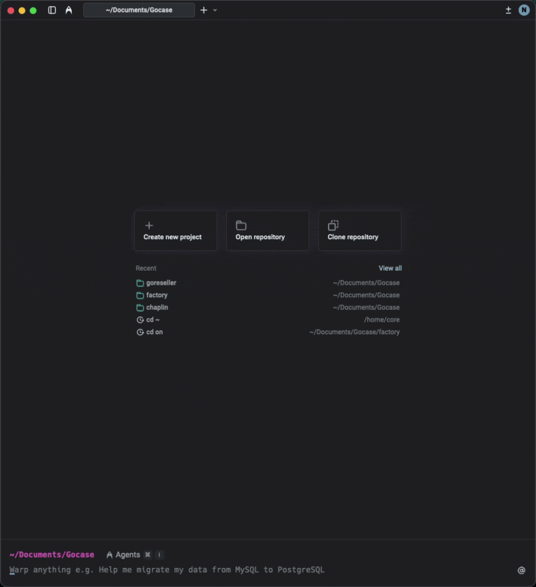
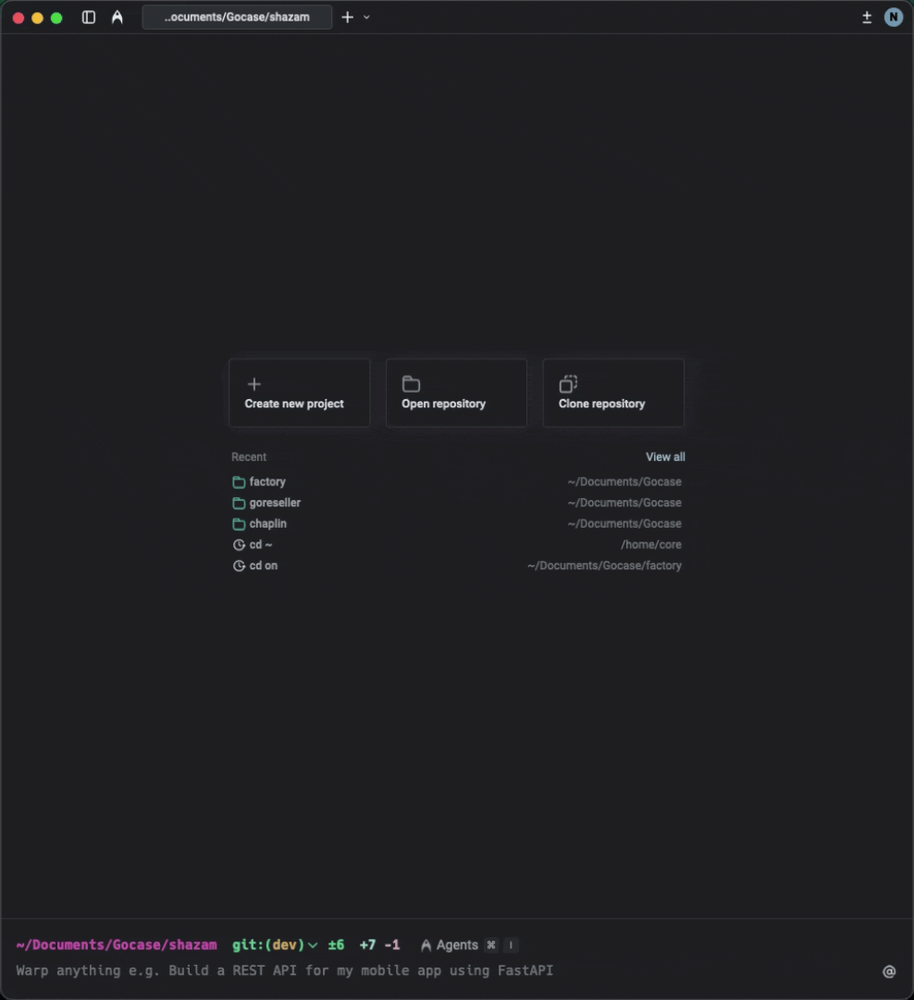

<p align="center">
  
</p>

<h1 align="center">dotcontext</h1>

<p align="center">
  <em>Scaffold AI context structure for your codebase</em>
</p>

<p align="center">
  <a href="https://github.com/goca-se/dotcontext/releases/latest"></a>
  <a href="https://github.com/goca-se/dotcontext/blob/main/LICENSE"></a>
</p>

`dotcontext` creates a standardized structure for AI assistants to understand your project. It generates templates and a Claude Code command that automatically analyzes and documents your codebase.

<p align="center">
  
</p>

## Installation

```bash
curl -sSL https://raw.githubusercontent.com/goca-se/dotcontext/main/install.sh | bash
```

Or manually:

```bash
curl -sSL https://raw.githubusercontent.com/goca-se/dotcontext/main/dotcontext -o /usr/local/bin/dotcontext
chmod +x /usr/local/bin/dotcontext
```

## Usage

### Initialize a project

```bash
cd your-project
dotcontext init
```

This creates the context structure and downloads templates.

**Options:**

```bash
dotcontext init --name "My Project"  # Set project name
dotcontext init --yes                # Skip prompts, use defaults
```

### Add context files

```bash
dotcontext add decision    # Architectural Decision Record
dotcontext add skill       # Step-by-step guide
dotcontext add prp         # Feature planning doc
dotcontext add command     # Claude Code slash command
```

### Update CLI

```bash
dotcontext update              # Update CLI to latest version
```

### Update templates

When new templates or commands are added to dotcontext, update your project:

```bash
dotcontext update --templates          # Add new files only
dotcontext update --templates --force  # Overwrite existing files
```

This is **safe by default**:

- Only adds NEW files
- Never overwrites your existing content
- Use `--force` only if you want to reset templates

### Run the setup command

After initialization, open Claude Code:

```bash
claude
> /setup-context
```

<details>
<summary>See it in action</summary>



</details>

## Decision Compliance

The generated `CLAUDE.md` includes instructions for AI assistants to **respect architectural decisions**.

When you ask Claude Code to make a change that conflicts with an existing ADR, it will:

1. **Stop and inform you** which decision(s) would be affected
2. **Ask explicitly** if you want to:
   - Proceed and update the decision
   - Modify the approach to comply
   - Cancel the change
3. **If updating**, create a versioned ADR (marking old one as `Superseded`)

This ensures your architectural decisions stay synchronized with your code.

## What It Creates

```
your-project/
├── CLAUDE.md                    # Quick reference + decision compliance rules
├── .context/
│   ├── CONTEXT.md               # Domain knowledge
│   ├── decisions/               # ADRs (versioned)
│   ├── skills/                  # Step-by-step guides
│   ├── examples/                # Reference code
│   └── prp/                     # Feature planning docs
│       ├── templates/
│       └── generated/
└── .claude/
    └── commands/
        ├── setup-context.md          # Auto-setup command
        ├── code-review.md            # Code review command
        ├── generate-prp.md           # Generate feature PRPs
        ├── execute-prp.md            # Execute PRPs step-by-step
        ├── dotcontext-add-decision.md # Add ADR interactively
        ├── dotcontext-add-skill.md    # Add skill interactively
        └── dotcontext-add-command.md  # Add custom command
```

Additionally, `dotcontext init` configures **native OS notifications** in `~/.claude/`:

```
~/.claude/
├── scripts/
│   └── notify.sh          # Cross-platform notification script
└── settings.json          # Hooks for Notification and Stop events
```

## Commands Reference

| Command                         | Description                        |
| ------------------------------- | ---------------------------------- |
| `dotcontext init`               | Initialize context structure       |
| `dotcontext add decision`       | Create an ADR (auto-numbered)      |
| `dotcontext add skill`          | Create a skill guide               |
| `dotcontext add prp`            | Create a feature planning doc      |
| `dotcontext add command`        | Create a Claude Code slash command |
| `dotcontext update`             | Update CLI to latest version       |
| `dotcontext update --templates` | Add new templates to project       |
| `dotcontext --help`             | Show help                          |
| `dotcontext --version`          | Show version                       |

## Built-in Slash Commands

### `/setup-context`

Analyzes your codebase and populates context files:

- Fills `CLAUDE.md` with stack, commands, rules
- Documents domain in `.context/CONTEXT.md`
- Creates ADRs for existing architectural decisions
- Sets up skills for recurring patterns
- Adds example files showing well-structured code

### `/code-review`

Performs structured code review checking:

- Correctness and edge cases
- Security vulnerabilities
- Performance issues
- Code quality and patterns
- Test coverage

### `/generate-prp <feature description>`

Generates a Product Requirements Prompt for a new feature:

- **Asks 10 clarifying questions** before generating (mandatory)
- Analyzes codebase patterns and existing architecture
- Consults skills and decisions for consistency
- Creates structured implementation plan with phases
- Saves to `.context/prp/generated/`

The clarifying questions ensure the PRP captures the right scope, constraints, and edge cases before any code is written.

Example:

```
> /generate-prp user authentication with OAuth
```

<details>
<summary>See it in action</summary>


</details>

### `/execute-prp <prp-name>`

Executes an existing PRP step-by-step:

- Reads the full PRP
- Checks prerequisites
- **Offers worktree isolation** for parallel development
- Implements in defined order
- Validates each phase (tests, linting)
- Stops on errors, fixes before continuing

#### Worktree Isolation

Before starting, the command asks if you want to create an isolated git worktree. This allows you to:

- Work on multiple features/fixes simultaneously
- Switch tasks without stashing or losing context
- Keep your main workspace clean

Branch types are automatically detected from PRP content:

| Type | Use case |
|------|----------|
| `feature/` | New functionality |
| `bugfix/` | Bug corrections |
| `hotfix/` | Urgent production fixes |
| `chore/` | Maintenance, refactoring |
| `experiment/` | Spikes, POCs |

Example:

```
> /execute-prp 20260129-user-auth

# Creates: ../your-project-user-auth (branch: feature/user-auth)
```

<details>
<summary>See it in action</summary>


</details>

### `/dotcontext-add-decision [title]`

Interactively create and populate an Architectural Decision Record:

- Asks clarifying questions about context and alternatives
- Auto-numbers the ADR (001, 002, ...)
- Populates with structured content
- Updates the decisions index

### `/dotcontext-add-skill [name]`

Interactively create and populate a skill guide:

- Analyzes codebase for existing patterns
- Asks about use cases and anti-patterns
- Includes real code examples from your project
- Creates step-by-step documentation

### `/dotcontext-add-command [name]`

Create a custom Claude Code slash command:

- Asks about command purpose and behavior
- Generates command file with proper structure
- Immediately available as `/your-command`

## Notifications

`dotcontext init` automatically configures native OS notifications for Claude Code:

| Event | When | Sound (macOS) |
|-------|------|---------------|
| **Notification** | Claude needs attention (question, permission) | Purr |
| **Stop** | Claude finished processing | Funk |

**Supported platforms:**

- **macOS**: Native notifications via `osascript`
- **Linux**: `notify-send` + `paplay`/`aplay`
- **Windows/WSL**: PowerShell toast notifications

No additional dependencies required.

## Requirements

- Bash 3.2+
- `curl` or `wget`

## Uninstall

```bash
rm /usr/local/bin/dotcontext
```
